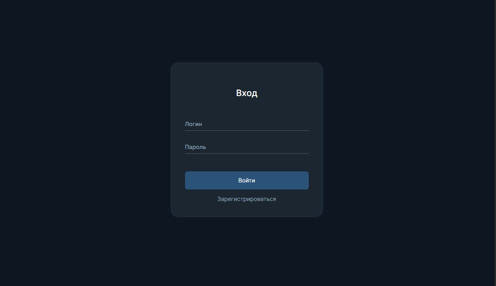
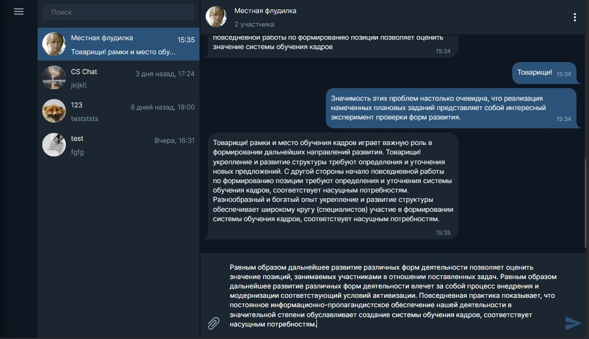
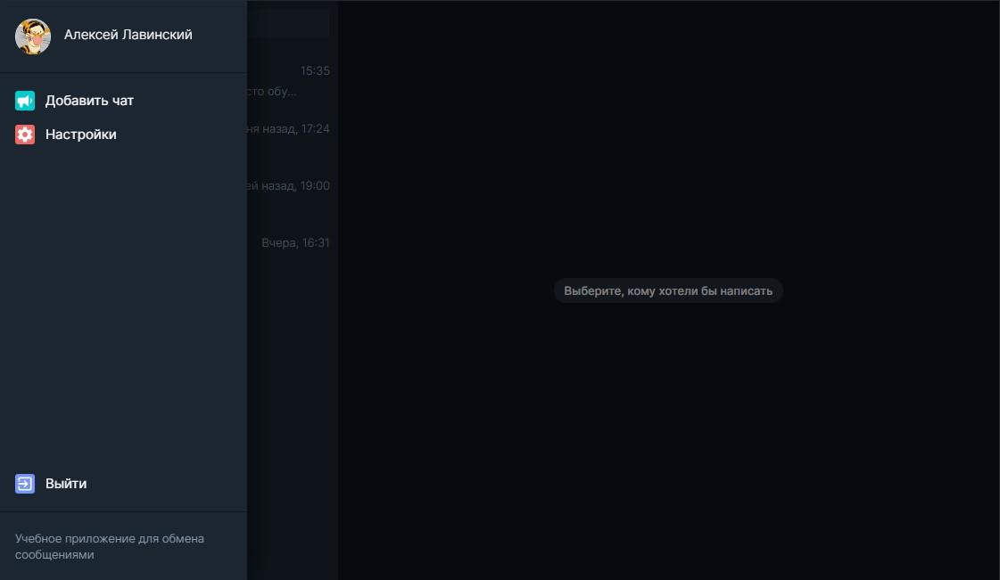
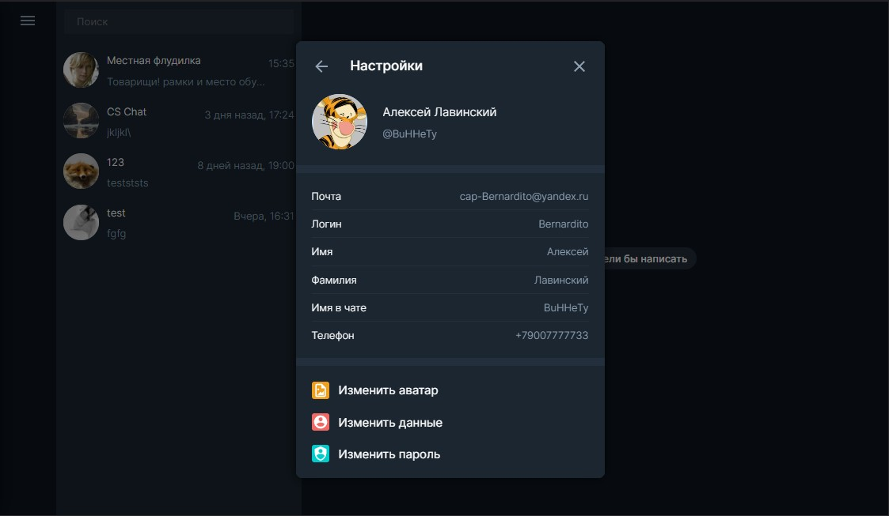
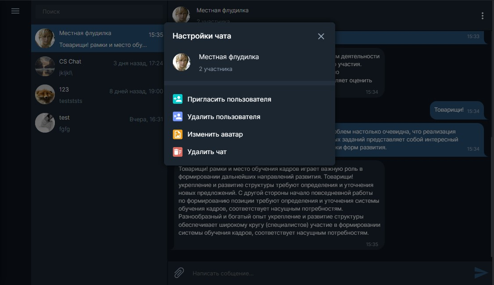

# Веб-приложение «Чат»

[](https://github.com/cap-Bernardito/middle.messenger.praktikum.yandex/actions/workflows/main.yml?query=branch%3Amain)

Учебный проект, разработанный в рамках курса "Мидл фронтенд-разработчик".

Для организации структуры папок проекта использована методология [FSD](https://feature-sliced.design/ru/docs/reference/units/layers).







[Ссылка на Netlify](https://cap-bernardito-ya-messenger.netlify.app)

[Ссылка на Render.com](https://cap-bernardito-messenger.onrender.com)

## Использованные технологии:

- TS
- WebSockets
- Jest
- GitHub Actions
- Docker

## Доступные команды

```bash
// Установка зависимостей
$ npm install

// Запуск проекта в режиме разработки
$ npm run dev

// Сборка проекта в папку `dist`
$ npm run build

// Сборка проекта в папку `dist` и раздача статики из нее с помощью `express`
$ npm run start

// Запуск тестов
$ npm run test
```
